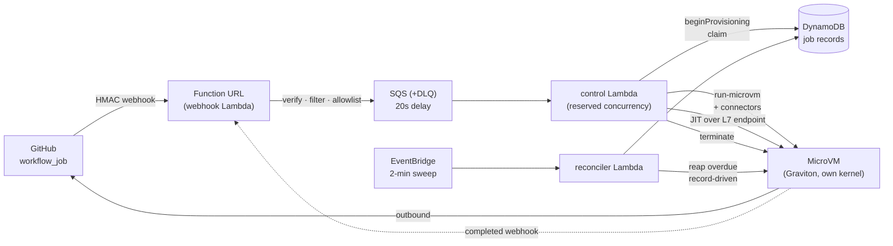

# Mayfly

**Ephemeral GitHub Actions runners on AWS Lambda MicroVMs.** Each CI job runs in a fresh, single-use
Firecracker MicroVM — JIT-registered, one job, then destroyed. Own kernel per job, no standing fleet.

- **Status:** deployed and **verified live** end-to-end on real AWS (ap-northeast-1). See [`docs/PROJECT-STATUS.md`](docs/PROJECT-STATUS.md).
- **Why (honestly):** own-kernel **isolation for untrusted / AI-generated CI code**, warm-start-at-zero-idle,
  and VPC access — **not** cost (it's a wash vs GitHub arm64-hosted; see [`docs/cost-comparison.md`](docs/cost-comparison.md)).
- **Live demo:** https://mikeng-io.github.io/mayfly-demo/ · demo repo: [`mayfly-demo`](https://github.com/mikeng-io/mayfly-demo).

## Architecture



**Per-job lifecycle:** `workflow_job (queued)` → webhook verifies HMAC, checks the allowlist, enqueues →
control Lambda makes a re-drivable claim, launches a MicroVM (auto-suspend **off**), records the id, hands
the runner a single-use JIT config over the L7 endpoint → the runner dials GitHub outbound and runs one job
→ `completed` webhook → teardown terminates the VM. A scheduled, **record-driven** reconciler reaps anything
teardown ever misses (never a region-wide terminate).

## Stack

| Layer | Choice |
|---|---|
| Infrastructure | **AWS CDK (TypeScript)** — all resources, no manual creation |
| Handlers | TypeScript / Node 20, ARM64 Lambdas ([why](docs/decisions/2026-07-11-handler-runtime.md)) |
| In-VM launcher | **Go** (static binary; receives JIT config, execs `run.sh`, optional lazy dockerd) |
| Compute | AWS **Lambda MicroVMs** (Firecracker, Graviton/ARM64), GA 2026-06-22 |
| State / queue | DynamoDB (correlation + idempotency, `state` GSI) · SQS + DLQ |
| Auth | GitHub **App** (JWT → installation token) · HMAC webhook · Function URL (auth NONE + HMAC, [ADR](docs/decisions/2026-07-10-webhook-ingress.md)) |
| Observability | CloudWatch alarms (DLQ / reclaim / quota-drop) → SNS |

## Repo layout

```
app/
  infra/        CDK stack (DynamoDB, SQS+DLQ, 3 Lambdas, Function URL, alarms, image-build role)
  src/
    handlers/   webhook · control · reconciler
    lib/        hmac · github · config · jobs · microvm · governance · manifest · types
  runtime/      Go in-VM launcher     image/  MicroVM runner Dockerfile (lean + docker targets)
  build-image.sh  scripts/setup-app.ts (one-button GitHub App)  INSTALL.md  AWS-LEDGER.md
spike/          the crux feasibility spikes (phase1 local, phase2 AWS, phase2b docker)
docs/           findings · decisions (ADRs) · reviews · runbooks · cost · research
```

## Run it

- **Install (adopter):** [`app/INSTALL.md`](app/INSTALL.md) — deploy → `build-image.sh` → `setup-app` → add `runs-on: [self-hosted, mayfly]`.
- **Deploy runbook (operator):** [`docs/runbooks/2026-07-11-phase6-deploy.md`](docs/runbooks/2026-07-11-phase6-deploy.md) — preconditions → deploy → live test → teardown.
- **Live AWS ledger:** [`app/AWS-LEDGER.md`](app/AWS-LEDGER.md).

## Governance (isolation is only half)

Fail-closed **org/repo allowlist** + **per-owner concurrency quota** (delayed-requeue backpressure) +
**fork-trust** detection — so an App installed too broadly can't spin up MicroVMs on your bill. v1 *records*
fork trust; the VPC-SG network gate is a documented post-v1 deferral.

## Honest scope & caveats

- **ARM64 (Graviton) only.** x86 needs QEMU emulation (slower; binfmt-in-MicroVM unverified).
- **L7-only endpoint** — no raw L4 / stable inbound IP (fine for an outbound-only runner).
- **Cost is a wash** vs GitHub arm64-hosted, and includes ops to run the control plane — adopt for isolation, not savings.
- v1 = single trust domain, per-job launch (Approach B). Warm suspended-pool (Approach C) and the fork-PR VPC gate are post-v1.

## Docs index

- **Findings** (verified facts + field notes + real pricing): [`docs/findings/2026-07-09-mayfly-microvm-findings.md`](docs/findings/2026-07-09-mayfly-microvm-findings.md)
- **Decisions (ADRs):** [`docs/decisions/`](docs/decisions/)
- **Reviews (adversarial):** [`docs/reviews/`](docs/reviews/)
- **Cost:** [`docs/cost-comparison.md`](docs/cost-comparison.md) + interactive `docs/mayfly-cost.html`
- **Status:** [`docs/PROJECT-STATUS.md`](docs/PROJECT-STATUS.md)
